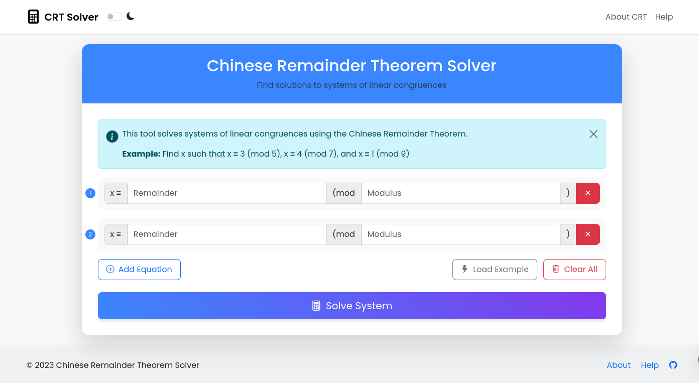

# Chinese Remainder Theorem Solver


A modern, interactive web application that solves systems of linear congruences using the Chinese Remainder Theorem. This tool helps you find solutions to problems of the form:

- x ≡ a₁ (mod m₁)
- x ≡ a₂ (mod m₂)
- ...
- x ≡ aₙ (mod mₙ)

## 📋 Table of Contents

- [Features](#-features)
- [Live Demo](#-live-demo)
- [Mathematical Background](#-mathematical-background)
- [Installation](#-installation)
- [How to Use](#-how-to-use)
- [Project Structure](#-project-structure)
- [Technical Implementation](#-technical-implementation)
- [Browser Compatibility](#-browser-compatibility)
- [Contributing](#-contributing)
- [License](#-license)

## ✨ Features

- **Interactive Interface**: Add, remove, and modify congruence equations dynamically
- **Step-by-Step Solutions**: View detailed calculation steps for educational purposes
- **Dark Mode Support**: Toggle between light and dark themes
- **Responsive Design**: Works on desktop, tablet, and mobile devices
- **Error Handling**: Clear error messages for invalid inputs or unsolvable systems
- **Example Loading**: Load a sample problem to understand how the system works
- **Copy Results**: Easily copy solution results to clipboard
- **Animated UI**: Smooth transitions and animations for a better user experience

## 🌐 Live Demo

[Try the live demo →](https://KSDeshappriya.github.io/chinese-remainder-solver)



## 📐 Mathematical Background

The Chinese Remainder Theorem (CRT) is a fundamental result in number theory that describes the existence and uniqueness of solutions to systems of linear congruences.

### The Theorem

If m₁, m₂, ..., mₙ are pairwise coprime positive integers, then the system of congruences:

```
x ≡ a₁ (mod m₁)
x ≡ a₂ (mod m₂)
⋮
x ≡ aₙ (mod mₙ)
```

has a unique solution modulo M = m₁ × m₂ × ... × mₙ.

### Solution Method

The solution is given by:

```
x ≡ (a₁M₁y₁ + a₂M₂y₂ + ... + aₙMₙyₙ) (mod M)
```

where:
- M = m₁ × m₂ × ... × mₙ
- Mᵢ = M / mᵢ
- yᵢ is the modular multiplicative inverse of Mᵢ modulo mᵢ (i.e., Mᵢyᵢ ≡ 1 (mod mᵢ))

## 🚀 Installation

### Option 1: Clone the Repository

```bash
# Clone this repository
git clone https://github.com/KSDeshappriya/chinese-remainder-solver.git

# Navigate to the project directory
cd chinese-remainder-solver

# Open index.html in your browser
# You can use a local development server like Live Server for VS Code
```

### Option 2: Download as ZIP

1. Click the "Code" button on the GitHub repository
2. Select "Download ZIP"
3. Extract the ZIP file to your preferred location
4. Open `index.html` in your web browser

## 📝 How to Use

### Basic Usage

1. **Enter your congruence equations**:
   - For each equation, enter the remainder and modulus
   - Example: For x ≡ 3 (mod 5), enter "3" as remainder and "5" as modulus

2. **Add or remove equations** using the "Add Equation" and "✕" buttons

3. **Click "Solve System"** to find the solution

4. **View the results**:
   - The smallest non-negative solution is displayed
   - The general form of the solution is shown (x = result + M·k)
   - Detailed calculation steps are available in the accordion section

### Advanced Features

- **Dark Mode**: Toggle the theme using the moon icon in the top navigation
- **Load Example**: Click to populate the form with a sample problem
- **Copy Solution**: Copy the results to your clipboard
- **View Calculation Steps**: Expand the accordion to see step-by-step workings

## 📂 Project Structure

```
chinese-remainder-solver/
│
├── index.html              # Main HTML file
├── assets/
│   ├── css/
│   │   └── style.css       # Styles for the application
│   └── js/
│       ├── app.js          # UI logic and event handlers
│       └── crt.js          # Implementation of the Chinese Remainder Theorem
└── README.md               # Project documentation
```

## 🔧 Technical Implementation

### Core Algorithm

The CRT implementation follows these steps:

1. Validate inputs and check if moduli are pairwise coprime
2. Calculate M (product of all moduli)
3. For each congruence:
   - Calculate Mᵢ = M / mᵢ
   - Find the modular multiplicative inverse of Mᵢ modulo mᵢ
   - Calculate the term aᵢ × Mᵢ × inverse
4. Sum all terms and take modulo M to get the final result

### Technologies Used

- **HTML5** for structure
- **CSS3** with custom properties for styling
- **JavaScript (ES6+)** for logic and DOM manipulation
- **Bootstrap 5** for responsive layout and components
- **Bootstrap Icons** for iconography

### Key Design Decisions

- **Separation of Concerns**: Algorithm logic (crt.js) is separated from UI logic (app.js)
- **Responsive Design**: Adapts to various screen sizes using Bootstrap grid and custom media queries
- **Accessibility**: Semantic HTML and proper ARIA attributes for better accessibility
- **Progressive Enhancement**: Core functionality works with minimal JS, enhanced features gracefully degrade
- **Dark Mode**: Implemented using CSS variables and data attributes

## 🌐 Browser Compatibility

- Chrome (latest)
- Firefox (latest)
- Safari (latest)
- Edge (latest)
- Opera (latest)
- Mobile browsers (iOS Safari, Android Chrome)

## 🤝 Contributing

Contributions are welcome! Here's how you can help:

1. Fork the repository
2. Create a feature branch: `git checkout -b feature/amazing-feature`
3. Commit your changes: `git commit -m 'Add some amazing feature'`
4. Push to the branch: `git push origin feature/amazing-feature`
5. Open a Pull Request

### Development Guidelines

- Maintain the existing code style
- Add comments for complex logic
- Ensure responsive design works on all screen sizes
- Test in multiple browsers before submitting

## 📄 License

This project is licensed under the MIT License - see the LICENSE file for details.

---

Created with ❤️ by KSDeshappriya
